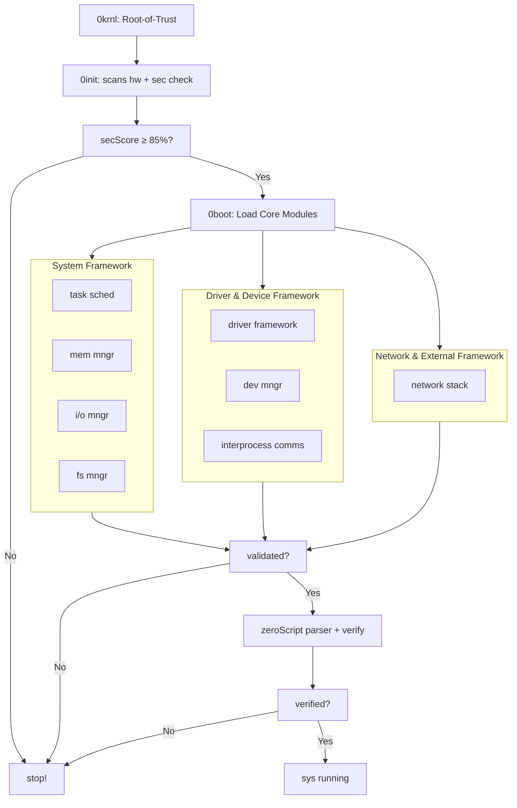

```mermaid
flowchart TD
    KRNL[0krnl: Root-of-Trust] --> INIT[0init: scans hw + sec check]
    INIT --> SEC[secScore ≥ 85%?]
    SEC -- No --> STOP[stop!]
    SEC -- Yes --> BOOT[0boot: Load Core Modules]

    %% Core Frameworks
    subgraph SYSFW[System Framework]
        SCHD[task sched]
        MEMR[mem mngr]
        IO[i/o mngr]
        FSYS[fs mngr]
    end

    subgraph DEVFW[Driver & Device Framework]
        DRV[driver framework]
        DEV[dev mngr]
        IPC[interprocess comms]
    end

    subgraph NETFW[Network & External Framework]
        NETW[network stack]
    end

    %% Connections
    BOOT --> SYSFW
    BOOT --> DEVFW
    BOOT --> NETFW

    SYSFW --> COREVAL[validated?]
    DEVFW --> COREVAL
    NETFW --> COREVAL

    COREVAL -- No --> STOP
    COREVAL -- Yes --> ZS[zeroScript parser + verify]
    ZS --> ZSVAL[verified?]
    ZSVAL -- No --> STOP
    ZSVAL -- Yes --> RUN[sys running]


```
